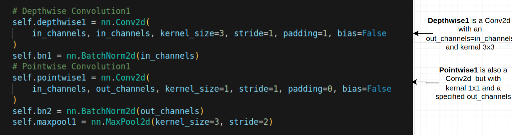

# depthwise-seperable-convolution-project
This project demonstrates the significance of Depthwise Separable Convolution in deep learning. The model is designed to detect candlestick chart patterns from input images, showcasing the efficiency and effectiveness of this convolutional technique in pattern recognition tasks.

## Understanding depthwise seperable convolution
Depthwise separable convolution splits the standard convolution into two simpler operations:
Depthwise convolution and Pointwise convolution
### Depthwise convolution
Applies a single filter to each input channel independently. Let's say you have RGB image,then you have 3 input channels, you apply 3 separate filters, one for each channel.
### Pointwise convolution
Applies a 1x1 convolution across all the channels, combining the outputs of the depthwise convolution into a new set of channels.

Check this article to dive deeper into depthwise seperable convolution:
https://towardsdatascience.com/a-basic-introduction-to-separable-convolutions-b99ec3102728

## Let's dive into our implementation
The purpose of this project is to train a model that reads a candlestick chart and classifies it as either a hammer candle, morning star candle, bullish engulfing candle, bearish engulfing candle, or another type.
We have 5 classes. The image below shows examples of bullish and bearish engulfing candles.

### Data collection and preprocessing
First, the format of our data is a pandas DataFrame, where each row contains the Open, High, Low, and Close values, these four columns define a candle.
Check this article to understand more Candlestick chart
https://www.investopedia.com/trading/candlestick-charting-what-is-it/

Then I transformed my DataFrame into images and I saved it in to the disk in order to use it in main.ipynb where I trained my model

Next, I transformed the DataFrame into images and saved them to disk for use in main.ipynb, where I trained the model.

The entire process described above is carried out in the data_construction.ipynb file.

### Building depthwise seperable convolution
In this project I used two depthwise seperable convolutions each followed by maxpooling layer, then followed by 3 fully connected layers.

The code snippet below explain the first depthwise seperable convolutions

## Results
I trained the model on 4,000 images, with 800 images per class to ensure balanced data across the five classes. The training process was run for 200 epochs.

For testing, I set aside an additional 2,000 images. The model performed impressively, achieving an overall accuracy of 97%.